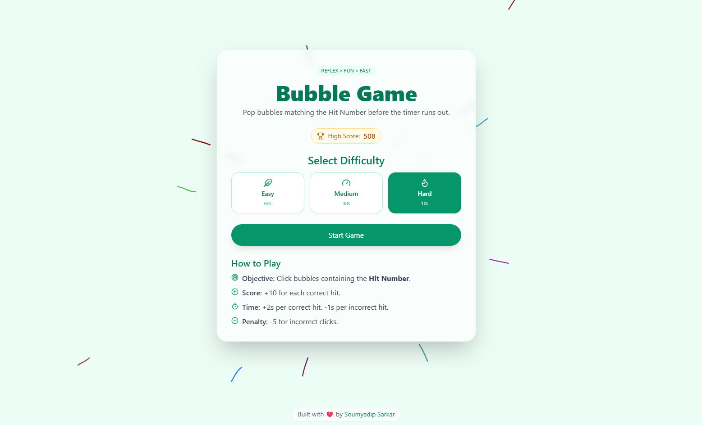

<h1 align="center">
Bubble Game
</h1>

<div align="center">

[](https://vite.dev/)
[](https://bubblegame.in/)
[](./LICENSE)

</div>

Bubble Game is a modern, interactive web game designed to challenge your reflexes and number recognition skills. Built with React, TypeScript, and Vite, it offers a fast, responsive, and engaging experience for players of all ages. Pop the correct bubbles before time runs out and climb the leaderboard!



## Features

- **Multiple Difficulty Levels:** Easy, Medium, and Hard modes to suit every player.
- **Dynamic Gameplay:** Bubbles regenerate with new numbers after each correct hit.
- **Scoring System:** Earn points and time bonuses for correct hits.
- **Penalty System:** Incorrect clicks deduct points, increasing the challenge.
- **Sound Effects:** Immediate feedback for correct and incorrect actions.
- **Local High Score Tracking:** Your highest and top 5 scores are saved locally.
- **Leaderboard:** Track your progress and compete with yourself.
- **Sound Toggle:** Mute or unmute sound effects at any time.

## How to Play

1. **Select Difficulty:** Choose Easy, Medium, or Hard on the home screen.
2. **Start the Game:** Click "Start Game" to begin.
3. **Objective:** Click bubbles containing the Hit Number shown at the top.
4. **Scoring:**
   - **Correct Hit:** +10 points, +2 seconds on the timer.
   - **Incorrect Click:** -5 points. -1 seconds on the timer.
5. **Game Over:** The game ends when the timer reaches zero. Try to beat your high score!
6. **In-Game Controls:**
   - **Exit:** Return to the home screen.
   - **Restart:** Start a new game with the current difficulty.
   - **Sound Toggle:** Mute or unmute sound effects.

## Getting Started

### Prerequisites

- Node.js (v18 or above)
- npm (included with Node.js)

### Installation

1. **Clone the repository:**

   ```bash
   git clone https://github.com/neuralsorcerer/bubble-game.git
   ```

2. **Navigate to the project directory:**

   ```bash
   cd bubble-game
   ```

3. **Install dependencies:**

   ```bash
   npm install
   ```

## Usage

### Run the Development Server

```bash
npm run dev
```

Visit [http://localhost:5173](http://localhost:5173) in your browser to play.

### Build for Production

```bash
npm run build
```

The optimized build will be available in the `dist` folder.

## Technology Stack

- **React** – JavaScript library for building user interfaces
- **TypeScript** – Typed superset of JavaScript
- **Vite** – Fast build tool and development server
- **Tailwind CSS** – Utility-first CSS framework
- **use-sound** – React hook for sound effects

## License

This project is licensed under the [MIT License](LICENSE).
