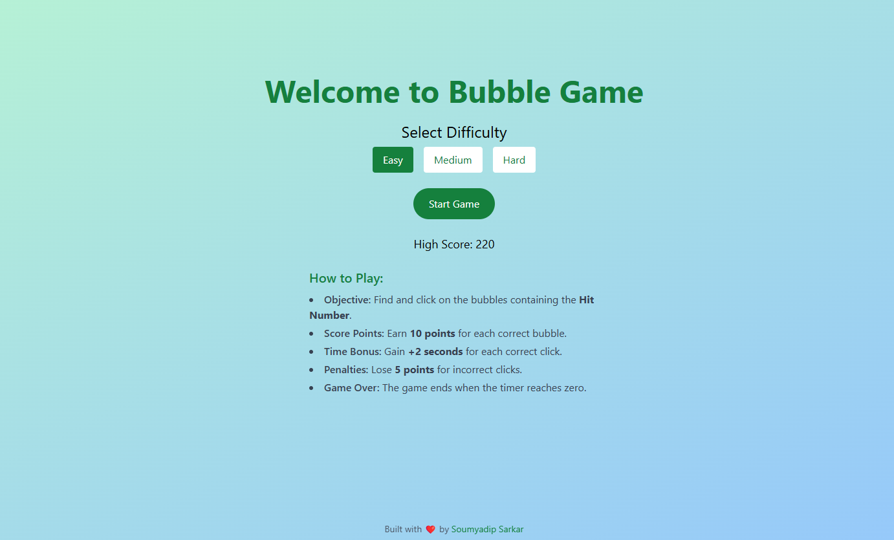

# Bubble Game

Welcome to Bubble Game! A fun and interactive game built with modern web technologies. Test your reflexes and number recognition skills by popping the right bubbles before time runs out!



## Features

- **Responsive Design:** Works seamlessly on all screen sizes.
- **Difficulty Levels:** Choose from Easy, Medium, or Hard modes.
- **Dynamic Gameplay:** Bubbles regenerate with new numbers after each correct hit.
- **Scoring System:** Earn points for correct hits and receive time bonuses.
- **Penalties:** Incorrect clicks deduct points, adding a challenge.
- **Sound Effects:** Enjoy feedback with correct and incorrect sounds.
- **High Score Tracking:** Your highest score is saved locally.
- **Leaderboard:** Top scores are stored locally so you can track your progress.
- **User-Friendly Interface:** Clean design with intuitive controls.
- **Separate Components:** Organized codebase with reusable components.

## How to Play

1. **Select Difficulty:** On the home screen, choose your desired difficulty level—Easy, Medium, or Hard.
2. **Start the Game:** Click on the "Start Game" button to begin.
3. **Objective:** Find and click on bubbles containing the Hit Number displayed at the top.
4. **Score Points:**
   - **Correct Hit:** Earn 10 points and gain +2 seconds on the timer.
   - **Incorrect Click:** Lose 5 points.
5. **Game Over:** The game ends when the timer reaches zero. Try to beat your high score!
6. **Controls During Game:**
   - **Exit Game:** Return to the home screen.
   - **Restart:** Start a new game with the current difficulty.

## Installation

### Prerequisites

- Node.js (v12 or above)
- npm (comes with Node.js)

### Steps

1. Clone the Repository:
   ```bash
   git clone https://github.com/neuralsorcerer/bubble-game.git
   ```
2. Navigate to the Project Directory:
   ```bash
   cd bubble-game
   ```
3. Install Dependencies:
   ```bash
   npm install
   ```

## Usage

### Running the Development Server

```bash
npm run dev
```

Open your browser and navigate to `http://localhost:5173` to play the game.

### Building for Production

```bash
npm run build
```

The optimized production build will be in the `dist` folder.

## Built With

- **React** - A JavaScript library for building user interfaces.
- **TypeScript** - A typed superset of JavaScript.
- **Vite** - A fast build tool and development server.
- **Tailwind CSS** - A utility-first CSS framework.
- **use-sound** - A React hook for playing sound effects.

## License

This project is licensed under the [MIT License](LICENSE).
